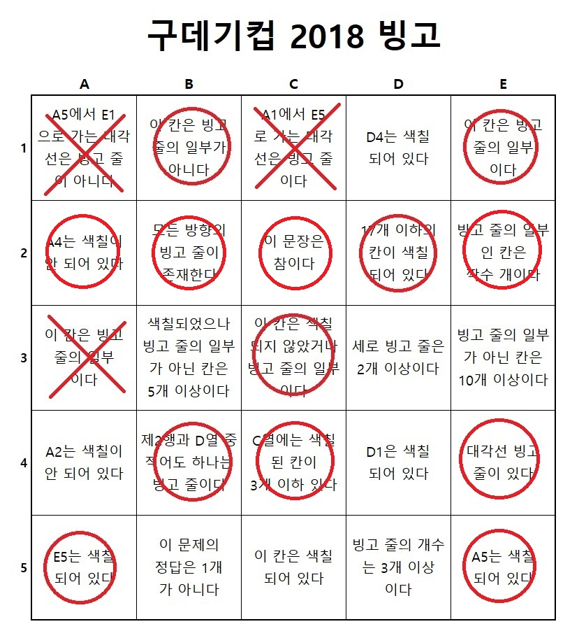
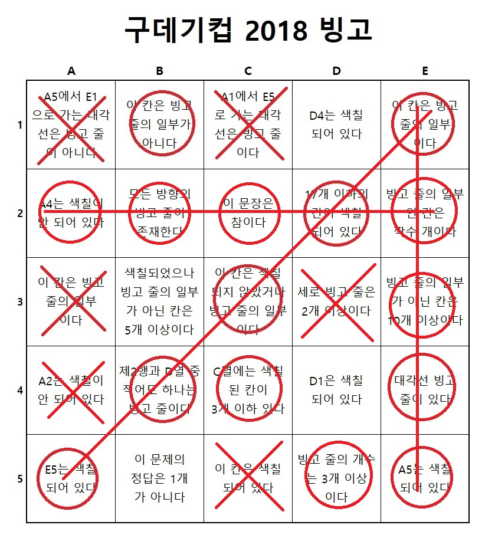

논리 문제.

우선 무조건 색칠되어야 하는 칸을 찾아야 한다.

자기 모순적인 문장들이 가득하기에 귀류법을 적용해본다.

1. c3를 거짓이라 가정하면 '색칠되지 않았다'가 충족되어 모순이 발생한다.
2. b1을 거짓이라 가정하면 '빙고 줄의 일부가 아니다'가 충족되어 모순이 발생한다.

c3가 빙고 줄이어야 한다. 우선 a1e5가 빙고라고 가정해보자.

1. c1이 충족된다.
2. 대각선 빙고가 생기므로 e4가 충족된다.
3. d4가 충족되므로 d1도 충족된다.
4. e5에 의해 a5가 충족된다.
5. b1에 의해 e1은 색칠되면 안된다.

6. 1행과 e열은 빙고가 아닌데 6칸이 색칠되었으므로 b3가 충족된다.
7. b2에 의해 d5가 만족된다.
8. a2와 a4는 동시에 만족될 수 없으므로 a열은 빙고가 아니고, 그로 인해 e3가 만족된다.

9. b2에 의해 세로 빙고는 존재해야 한다.
   1. a열은 빙고가 아니다.
   2. b1에 의해 b열은 빙고가 아니다.
   3. c4와 c5가 동시에 만족될 수 없으므로 c열은 빙고가 아니다.
   4. e1이 x이므로 e열은 빙고가 아니다.
   5. d열이 빙고이면 d3에 의해 세로 빙고줄이 2개 이상이어야 하지만 나머지 열은 빙고가 될 수 없어서 모순이 발생한다.

즉, a1e5는 빙고가 될 수 없으므로 c1이 거짓이 된다. 그럼 3행이 빙고라고 가정해보자.

1. d3에 의해 세로 빙고가 2개 이상이어야 한다.
   1. a열은 a2 a4에 의해 빙고가 아니다.
   2. b1에 의해 b열은 빙고가 아니다.
   3. c4에 의해 c열은 빙고가 아니다.
   4. 즉 d, e가 빙고다.

2. d열이 빙고이므로 b4가 충족된다.
3. e5 -> a5

4. a5e1이 빙고 -> ~a1
5. b2 만족

6. 현재 17칸이 색칠되었다. d2에 의해 나머지가 모두 거짓이 되어야 한다.
   1. a2와 a4는 동시에 거짓일 수 없다. 모순발생
   2. 즉, 3행은 빙고가 아니다.

a1e5, 3행이 빙고가 아니므로 a3도 거짓이 된다.

c3가 참이므로 마지막으로 남은 a5e1이 빙고다. a1은 거짓이 되고 e4와 e5가 만족된다.

1. c4를 검토해보자. c4가 거짓이라 가정한다.
   1. 그러면 c열에 색칠된 칸이 4개 이상이어야 한다.
   2. c1과 c4가 X면 색칠된 칸이 3개 이하이므로 c4를 만족한다. 모순.
   3. 즉, c4는 참이다.

1. b4를 검토해보자.

   1. d열이 빙고라고 가정하자.

      

      1. d3에 의해 세로 빙고가 더 필요하다

         1. a열은 빙고가 아니다
         2. b1에 의해 b열은 빙고가 아니다.
         3. c열은 빙고가 아니다.
         4. 즉, e열이 빙고다.

         

      2. e2를 확인해보자. 현재 빙고의 일부인 칸은 13칸이다.

         1. 2행을 빙고로 만들거나 4, 5행을 빙고로 만들어야 한다. 어느 쪽이든 3칸을 더 칠한다.
            1. 색칠된 칸이 18이 되어 d2에 위배된다. 모순.
            2. 즉, d열은 빙고가 아니다.

   2. d열이 빙고가 아니므로 2행이 빙고다.(c2는 논리적 역설이라 참이라고 하기 좀 그렇다. 문제가 좀...)

​			

1. d열이 빙고가 아님 -> ~d3
  2. a2 -> ~a4

  3. c4 -> ~c5 

  4. b2 -> e열 빙고 -> d5

     

2. d1, d4가 X라 가정해보자
   	1. b1, c4, d1, d4, d5에 의해 b3가 만족된다.
   	2. 색칠된 칸이 18개가 되어 d2에 위배된다.
   	3. 즉, d1, d4는 X

1. b1에 의해 b열은 빙고가 아니므로 b3, b5중 적어도 하나는 거짓이다.
   1. 그러면 '색칠되었으나 빙고의 일부가 아닌 칸'이 최대 4칸이 된다.
   2. 즉, b3가 거짓이다.

1. b5를 검토하자. 남은 경우의 수는 b5가 TF인 두 경우 뿐이다.
   1. b5가 참이면 b5가 색칠되어야 하므로 경우의 수가 하나가 되어 모순이 발생한다.
   2. 즉, b5는 거짓이다.