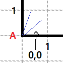
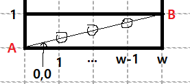

# 멀쩡한 사각형

대각선이 지나는 칸의 갯수를 구해야 하는데, 파이썬으로 최대공약수 공식을 이용하지 않으면 시간초과를 해결할 수 있는 방법이 있는지 모르겠다.

공식 증명이 궁금해서 찾아봤다. 증명이라고 주장하는 국내 글들을 읽어봤는데 전부 증명이 아니었다.

좀 답답해서 증명을 따로 md파일에 적어둔다.

## case1. w, h가 서로소일 경우(1, 1 제외)

대각선 방향은 좌하단 -> 우상단으로 둔다. (다른 방향도 상관 없다)

A에서 대각선이 출발한다고 하면 출발점이 있는 0,0은 무조건 횡단한다.

대각선의 진행을 따라가면서 횡단하는 칸을 셀 것이다. 0,0을 미리 포함하여 횡단하는 칸을 세는 변수 `inter_cnt = 1`로 둔다.

이후 대각선은 우상단 꼭지점을 향하며 0,0을 제외한 (w-1)개의 세로선과 (h-1)개의 가로선을 횡단한다.

둘이 서로소인 경우는 나누어 떨어지지 않기 때문에 대각선이 십자 교차점을 지나지 않는다. 그러므로 선을 횡단할 때마다 한 칸의 정사각형을 추가로 횡단하는 것이 된다.

그러면 횡단 정사각형 갯수는 다음과 같다.

`inter_cnt = 1 + (w - 1) + (h - 1)`이다.

## case2. w, h가 서로소가 아닐 경우

w, h의 최대 공약수를 gcd라고 하면

w/gcd, h/gcd는 서로소이므로 case1로 나눠서 생각한다.

작은 직사각형에 대한 횡단 칸 수는 다음과 같다.

`inter_cnt = 1 + (w/gcd - 1) + (h/gcd - 1)`

그리고 w/gcd, h/gcd인 직사각형이 대각선을 따라 gcd개 존재함은 자명하다. 그러므로 전체 사각형의 횡단 칸 수는 

`inter_cnt * gcd = gcd + (w - gcd) + (h - gcd) = w + h - gcd`

## 결론

그러므로 가로 w, 세로 h인 사각형의 대칭되는 꼭지점을 이은 대각선이 횡단하는 칸 수는 `w + h - gcd(w, h)`이다.

문제에서는 횡단하지 않는 칸 수를 구하는 것이므로 정답은 

`w * h - (w + h - gcd(w, h))`가 된다.

##  

